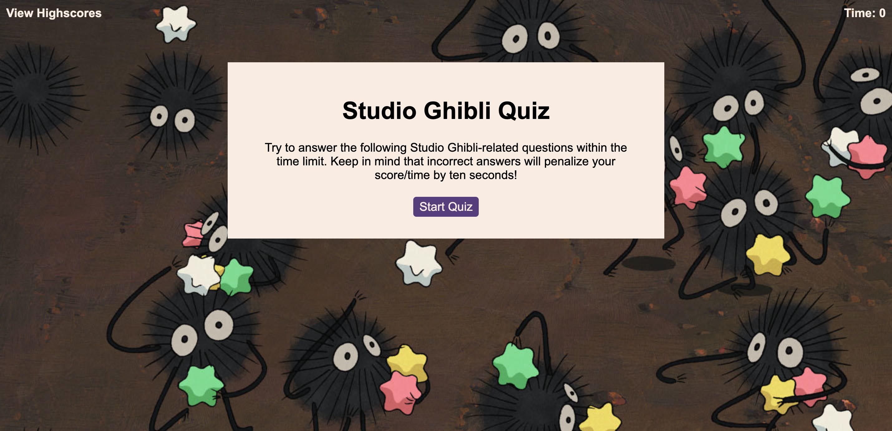
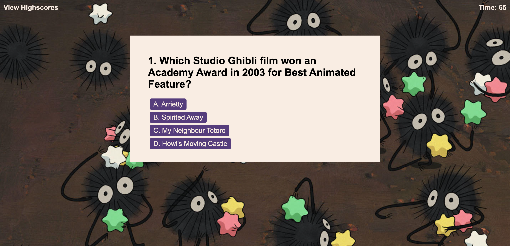
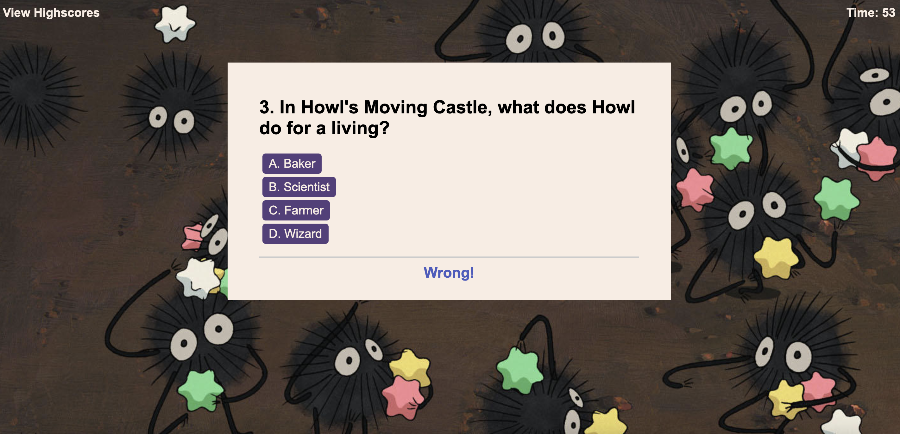
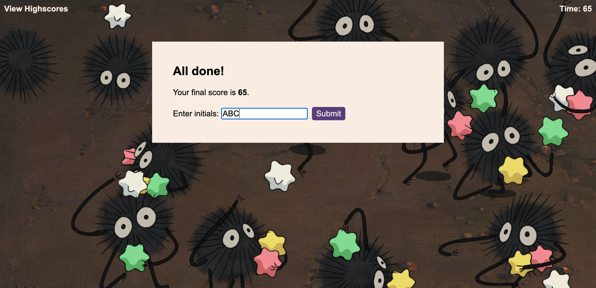
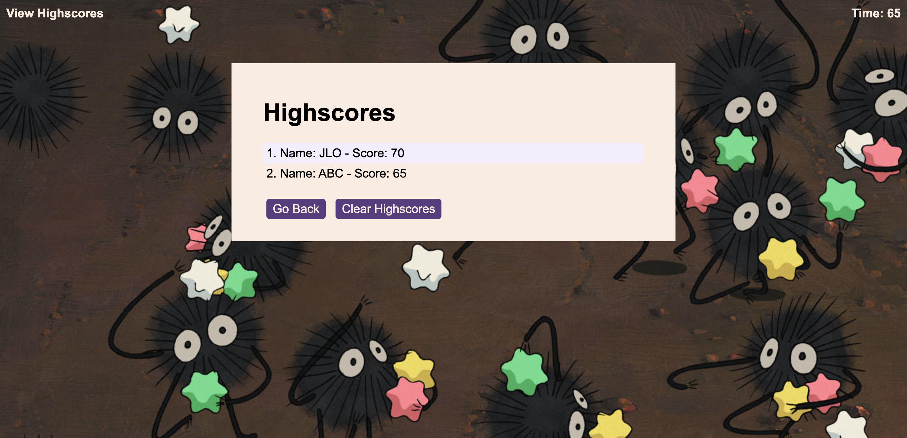

# Studio Ghibli Quiz
Challenge 6 - A quiz created in JavaScript on the films from Studio Ghibli

## Description

This online quiz showcases the Javascript skills I have gained from Module 6 (Workig with Web APIs) of the Front-end Web Development Bootcamp. 

I have developed an online quiz about the films from the animation Studio Ghibli. The quiz runs in the browser and features dynamically updated HTML and CSS powered by the JavaScript code that I have written.

The application has been optimised for viewing across all devices. 

## Usage

1. The **Studio Ghibli** quiz can be accessed online on Github pages: [https://jilloreilly.github.io/jill-oreilly-ghibli-quiz/index.html](https://jilloreilly.github.io/jill-oreilly-ghibli-quiz/index.html)
2. Click on the "Start Quiz" button      

3. The player will be presented with the first question and a choice of answers (A, B, C, D) and the timer will start counting dpwm from 75

4. Feedback will be shown to the player if the answer is correct or incorrect. If the answer is incorrect, 10 seconds will be deducted from the timer 

5. At the end of the quiz, the player's final score (the time left) will be displayed as well as the ability to enter their initials and save it to the HighScores page.

6. Once the player's initials have been submitted, the player is shown the high scores. The player has the choice to clear the highscores and/or start the quiz again

## Credits

Thank you to the following:

- MDN web docs for:
  - [sort()](https://developer.mozilla.org/en-US/docs/Web/JavaScript/Reference/Global_Objects/Array/sort)
  - [forEach()](https://developer.mozilla.org/en-US/docs/Web/JavaScript/Reference/Global_Objects/Array/forEach)
  - [JSON.stringify()](https://developer.mozilla.org/en-US/docs/Web/JavaScript/Reference/Global_Objects/JSON/stringify)
  - [JSON.parse()](https://developer.mozilla.org/en-US/docs/Web/JavaScript/Reference/Global_Objects/JSON/parse) 

- W3CSchools for [removeChild()](https://www.w3schools.com/jsref/met_node_removechild.asp)

- Free Code Camp for [array of objects](https://www.freecodecamp.org/news/javascript-array-of-objects-tutorial-how-to-create-update-and-loop-through-objects-using-js-array-methods/)

- Scaler for [Sorting an array of Objects](https://www.scaler.com/topics/javascript-sort-an-array-of-objects/)

- Studio Ghibli for [Spirited Away film still](https://www.ghibli.jp/works/chihiro/#frame)

- My TA **Christopher Kratz** for guiding and advising Pod 2 through the start of the challenge.

## License

MIT License

Copyright (c) 2023 Jill O'Reilly

Permission is hereby granted, free of charge, to any person obtaining a copy
of this software and associated documentation files (the "Software"), to deal
in the Software without restriction, including without limitation the rights
to use, copy, modify, merge, publish, distribute, sublicense, and/or sell
copies of the Software, and to permit persons to whom the Software is
furnished to do so, subject to the following conditions:

The above copyright notice and this permission notice shall be included in all
copies or substantial portions of the Software.

THE SOFTWARE IS PROVIDED "AS IS", WITHOUT WARRANTY OF ANY KIND, EXPRESS OR
IMPLIED, INCLUDING BUT NOT LIMITED TO THE WARRANTIES OF MERCHANTABILITY,
FITNESS FOR A PARTICULAR PURPOSE AND NONINFRINGEMENT. IN NO EVENT SHALL THE
AUTHORS OR COPYRIGHT HOLDERS BE LIABLE FOR ANY CLAIM, DAMAGES OR OTHER
LIABILITY, WHETHER IN AN ACTION OF CONTRACT, TORT OR OTHERWISE, ARISING FROM,
OUT OF OR IN CONNECTION WITH THE SOFTWARE OR THE USE OR OTHER DEALINGS IN THE
SOFTWARE.

## Technologies Used

